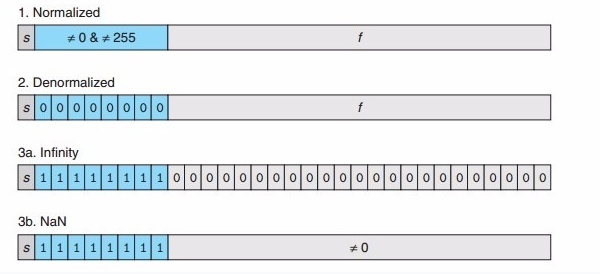

#《深入理解计算机系统》 读书笔记

##Chapter 1 - 计算机系统漫游
* 只由ASCII字符构成的文件成为*文本文件*，其他的所有文件成为*二进制文件* 
* 编译系统的四个阶段：
	* 预处理阶段
	* 编译阶段
	* 汇编阶段
	* 链接阶段
* 系统的硬件组成
	* 总线 ：贯穿整个系统的电子管道，通常被设计为传送定长的字节块，也就是字（word）。字的字节数是一个基本的系统参数，称为字长。
	* I/O设备：负责系统和外界的联系通道。例如显示器，键鼠，磁盘等等。
	* 主存：有一组DRAM芯片组成，是一个临时存储设备，用于存放处理器所需的程序和数据。
	* 处理器：解释储存在主存中指令的引擎。处理器的核心为*程序计数器*（PC）的字长大小的寄存器。在任意时间点，PC都指向主存中的某条机器语言指令（地址）。
* 高速缓存
	* 由于主存与处理器寄存器的读取速度差距过大，需要在主存和寄存器中间加入高速缓存，用于存放处理器在不久的将来可能会用到的信息。
	* 高速缓存可以使存储设备分层。速度越快的设备容量越小；而容量越大的设备速度则越慢。针对不同的需求进行满足，同时节约成本。
* 操作系统
	* 操作系统是硬件和应用程序中间的一层软件
	* 可以防止硬件被失控的应用程序滥用
	* 和为应用程序提供使用复杂硬件的简单接口 
* **进程**
	* 进程是操作系统对应用程序的一种抽象。一个系统上可以同时运行多个进程，然而每个进程都好像独占地使用硬件。实际一个进程的指令和另一个进程的指令是交错执行的。操作系统实现这种交错执行的机制称为**上下文切换**（context switching）。
	* 上下文（context）为操作系统保持进程运行所需的所有状态信息。任何时刻，只有一个进程在运行，当操作系统决定从当前进程转移到某个新进程时，就会进行上下文切换。
	* 上下文切换的过程为：系统保存当前进程的上下文，恢复新进程的上下文，将控制权转移到新进程，新进程从它上次停止的地方开始。
* 线程：一个进程由多个线程组成，每个线程都运行在进程的上下文中，并**共享相同代码和全局数据**。
* 虚拟存储器：是一个抽象概念，为每个进程提供假象，好像每个进程都在独占的使用内存，每个进程看到的存储器都是一样的，称为**虚拟地址空间**。
	* 虚拟地址空间由大量定义的区组成，每个区都有专门的功能。
		* 代码和数据
		* 堆：运行时可以动态分配的地址空间
		* 共享库：动态链接
		* 栈：函数调用
		* 内核虚拟存储器：应用程序不可读写
* 文件：字节序列。**每个I/O设备，包括键鼠，显示器，甚至网络都可以被视为文件**。文件使应用程序可以统一的看待各式的I/O设备，而无需了解I/O设备的不同技术。
* 操作系统内核提供了三个基础的抽象概念：
	* 文件：I/O设备的抽象
	* 虚拟存储器：主存和磁盘的抽象
	* 进程：处理器，主存和I/O设备的抽象
* 网络提供了计算机系统间的通信，网络实际可以视为一种I/O设备。	 

##Chapter 2 - 信息的表示和处理
* 最重要的三个数字编码
	* 无符号（unsigned），表示大于或等于0的数字
	* 二进制补码（two's-complement），表示有符号（正负）整数
	* 浮点数（floating-point），表示实数的科学记数法 
	* **值得注意的是，浮点数是不可结合的**，因为精度有限
	* 在Lua中，`print(3.14+1e+20-1e+20)`得`0`，而`print(3.14+(1e+20-1e+20))`得`3.14`
* 字节（byte）：8位的块，是大多数计算机的最小可寻址存储器单位
* 字长（word size）：指明整数和指针的标称大小。其决定了虚拟地址空间的最大大小。如32位字长，限制了虚拟地址空间大小为`2^32Byte = 4GB`。
* 寻址：多字节对象被存储为连续的字节序列，对象的地址为字节序列的最小地址。
* 字节顺序：
	* 如：`0x01234567`，存在0x100~0x103的字节顺序中，最高的字节为01，最低的字节为67
	* 小端法：最低的地址存最低的位 从0x100~0x103分别为 67 45 23 01
	* 大端法：最高的地址存最低的位 从0x100~0x103分别为 01 23 45 67
* 使用ascii码在任何系统都将得到相同的结果，与字节顺序和字大小规则无关。因而，文本数据比二进制数据有更强的平台独立性。
* 有关字符编码，可参考博文：[字符编码笔记：ASCII，Unicode和UTF-8](http://www.ruanyifeng.com/blog/2007/10/ascii_unicode_and_utf-8.html)。
* 布尔代数的特性：
	* a | ~a = 1
	* a & ~a = 0
	* a ^ a = 0
	* a ^ ~a = 1
	* a ^ 0 = a
	* a ^ 1 = ~a
* DeMorgan's law:
	* ~(a&b) = ~a | ~b
	* ~(a|b) = ~a & ~b
* 利用亦或操作的特性构造的原地换位代码：
```C
void inplace_swap(int *x, int *y)
{
	*x = *x ^ *y;
	*y = *x ^ *y;
	*x = *x ^ *y;
}
```

* 位向量的应用：
	* 有限集合，若位为1，则表示集合中包含了该位下标的值的数字；若位为0，则相反。

		例如一个位向量为a=[01101001]表示集合A={0,3,5,6}；位向量b=[01010101]表示集合B={0,2,4,6}。则 a|b = A并B ; a&b = A交B，而~a = A的补集。

	* 掩码（masking）运算：

		掩码0xFF = 000...00011111111 则x&0xFF = 由x最低有效字节组成的值，其他字节都被置为0。

		~0将生成一个全1的掩码，不管机器的字长是多少，具有很强的移植性。

		C中逻辑运算和位运算是完全不同的。而且逻辑运算具有断路的特性：若对第一个参数求值能确定表达式的值，那么逻辑运算符将不会对第二个参数进行求值。

* 移位运算：
	* 左移 <<：丢弃k个最高位，最低位补k个0 
	* 逻辑右移 >>：丢弃k个最低位，最高位补k个0
	* **算术右移** >>：丢弃k个最低位，最高位**补k个最高位的拷贝**
	* 无符号数（unsigned）的右移必须是逻辑右移，补0
	* 有符号数的右移大多数使用算术右移，补最高位的拷贝

* **二进制补码**（two's-complement）的表示：将字的最高有效位解释为负权。
	* 二进制补码的值可用如下公式求出：$B2T_{w}(\vec x)  \equiv -x_{w-1}2^{w-1} + \sum_{i=0}^{w-2}x_{i}2^{i} $
	
	* 最高有效位（$x_{w-1}$）被称为符号位（sign bit），设为1时，表示值为负数；设为0时，表示非负。
	* 二进制补码的范围是不对称的：
		* $ |TMin_{w} = TMax_{w} + 1| $ 即，**$TMin_{w}$没有与之对应的正数**
		* 最大的无符号值比最大的补码值的两倍大一：$UMax_{w} = 2TMax_{w} + 1$
		* 补码中的-1与$UMax_{w}$是同样的位序列
	* 强制类型转换：没有改变参数的位表示，即位序列不变，但是改变了这些位的解释
	* **二进制补码与无符号数的映射关系**如下：
	$$T2U_{w}(x) = \begin{cases} 
	x+2^{w},& x<0\\
	x,& x\geq0
	\end{cases}$$
	可见-1在补码中被转换成了最大的无符号数
	* **无符号数与二进制补码的映射关系**如下：
	$$U2T_{w}(x) = \begin{cases} 
	x,& x<2^{w-1}\\
	x-2^{w},& x\geq2^{w-1}
	\end{cases}$$
	* 一个方便记忆的记法是：对于$0 \leq x < 2^{w-1}$的值，二进制补码与无符号的表示是一样的，值都是x；对于之外的值只需加上或减去$2^{w-1}$即可
* 在C语言中的`printf`函数中，%d表示有符号十进制，%u表示无符号十进制
* 在C语言中，如果表达式两端分别为有符号和无符号，则会**隐含地将有符号强制转换为无符号然后进行运算**，这常常导致bug出现
* 无符号整数扩展：在开头添加k个0，称之为零扩展
* 二进制补码扩展：在开头添加k个最高有效位的值，被称为**符号扩展**
* 由于有符号与无符号的强制转换经常导致困扰，因此建议**不使用无符号整数类型**。
* 整数运算
	* 无符号加法：对于精度有限的无符号整数的加法，可能会产生溢出（丢弃最高位）。
	对于$0\leq x,y \leq2^{w}-1$:
		$$x+y = \begin{cases} 
		x+y,& x+y<2^{w}\\
		x+y-2^{w}& 2^{w}\leq x+y<2^{w+1}
	\end{cases}$$
	判断溢出的一个方法是对于$s=x+y$，如果$s < x$或 $s < y$则表示溢出。
	* 二进制补码加法：先将加号两端二进制补码转为无符号，然后执行无符号加法，然后再转为二进制补码形式
	对于$-2^{w-1}\leq x,y \leq2^{w}-1$:
		$$x+y = \begin{cases} 
		x+y-2^{w},& 2^{w-1}\leq x+y & 正溢出（更小）\\ 
		x+y,& -2^{w-1}\leq x+y<2^{w-1} & 正常\\
		x+y+2^{w}& x+y<-2^{w+1} & 负溢出（更大）
	\end{cases}$$
	* 二进制补码的负运算（非）
	对于$-2^{w-1}\leq x < 2^{w-1}$:
	$$-x = \begin{cases} 
		-2^{w-1},& x=-2^{w-1}\\
		-x& x > -2^{w-1}
	\end{cases}$$
	一种有名的位运算技术：$-x = \tilde x + 1$
	即对x的每位取反然后再+1。
	* 整数乘法：	
	对于$-2^{w-1}\leq x,y \leq2^{w-1}-1$:
	$$x * y = (x * y)\ mod\ 2^{w} $$
	* 整数除法 $x/y$
		* 永远得到整数
		* 若得到小数，则：
			* **若x与y同号，说明得到正数，则对结果向下取整**，如$5/2 = \lfloor2.5\rfloor = 2$
			*  **若x与y不同号，说明得到负数，则对结果向上取整**，如$-5/2 = \lceil-2.5\rceil = -2$
	*  IEEE 754 **浮点数表示**
		*  浮点数的表示：$V = (-1)^{s} \times M \times 2^{E} $
			*  s表示sign，符号位，负数为1，正数为0
			*  M表示有效位，为一个二进制小数
			*  E表示2的幂
	  * 域（二进制位序列）的划分：
		  * 单独的符号位s
		  * k位的指数域$e_{k-1}...e_{1}e_{0}$ 编码E
		  * n位的小数域$f_{n-1}...f_{1}f_{0}$ 编码M
	 * 其中指数域的有三种不同表达：
	     * 规格化值：指数域不全是0，也不全是1
		 $$E = e_{k-1}...e_{1}e_{0} - (2^{k-1} - 1)$$
		 $$M = 1 + \frac {f_{n-1}...f_{1}f_{0}} {2^n} $$
		 
		    * 非规格化值：指数域全是0
				$$E = 1 - (2^{k-1} - 1)$$
		 $$M = \frac {f_{n-1}...f_{1}f_{0}} {2^n} $$
			* 特殊数值：指数域全为1，若小数域全部为0，则表示无穷大；否则，表达NaN（Not a Number）
			

	* 舍入：由于浮点数的表示精度有限，所以会需要进行舍入。
		* 最常用的舍入方式为偶数舍入，即先向最近的值进行舍入，如果为中间数值，则向偶数进行舍入。
		* 向偶数舍入可以避免统计偏差，即向上舍入或者向下舍入都容易使平均值的结果偏高或者偏低。
	* 浮点数运算：因为舍入会带来精度丢失，而且浮点数加法不具备结合性（即：只要运算符的位置不改变，则运算顺序的改变不会带来结果的影响），所以会有不一致的情况出现。
		* 如：`(3.14+1e10) - 1e10`因为舍入会得到0.0；而`3.14+(1e10-1e10)`则会得到3.14。**这是在日常编码中需要注意到的地方。**
	* **奇技淫巧**
		* 使用二进制补码，可以利用位运算求负`~x+1 = -x`
		* 可以利用移位运算轻松制造掩码。比如制造0xFF，可以用`(1<<8)-1`获得。更一般的，制造最低位为连续k个1时，可用`(1<<k)-1`生成。
		* `(x<<3) - x = 7*x`利用快速的移位操作避免了较复杂的乘法运算